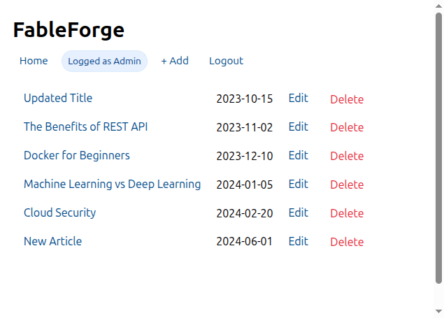

# FableForge

A personal blog project built with FastAPI.



> "Valar morghulis. Valar dohaeris. Valar... blogis."

This project is an implementation of the [Personal Blog](https://roadmap.sh/projects/personal-blog) challenge from [roadmap.sh](https://roadmap.sh).

## Features

- **CRUD Operations**: Create, Read, Update, and Delete blog articles.
- **Authentication**: Simple admin login system using cookies.
- **Backend**: Built with FastAPI and Python.
- **Storage**: JSON file-based database (`database.json`).
- **Frontend**: Server-side rendering with Jinja2 templates.

## How to Run

1. **Install dependencies**:

   ```bash
   pip install fastapi uvicorn python-multipart jinja2
   ```

2. **Start the server**:

   ```bash
   uvicorn main:app --reload
   ```

3. **Access the application**:
   Open your browser and navigate to `http://127.0.0.1:8000`.

## Admin Access

To manage articles (create, edit, delete), log in at `/login`.

- **Username**: `admin`
- **Password**: `password123`
